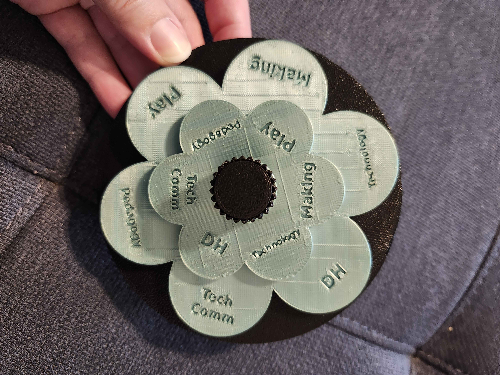
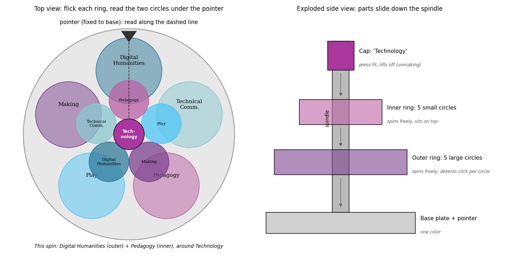
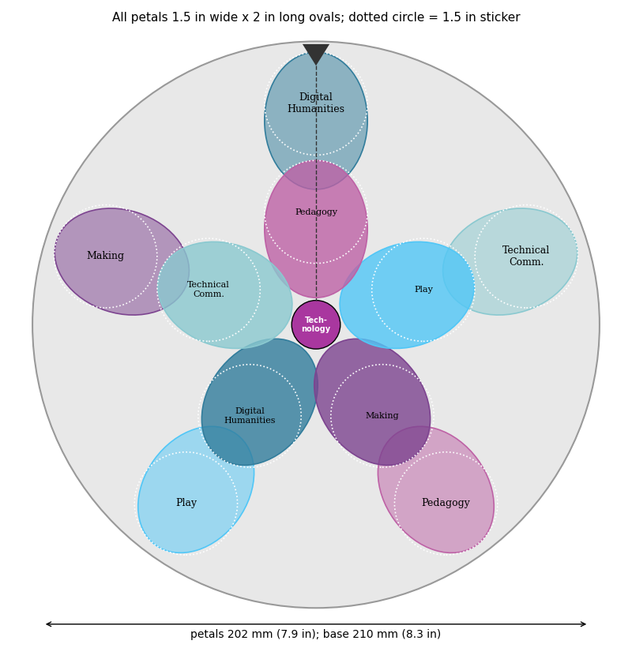
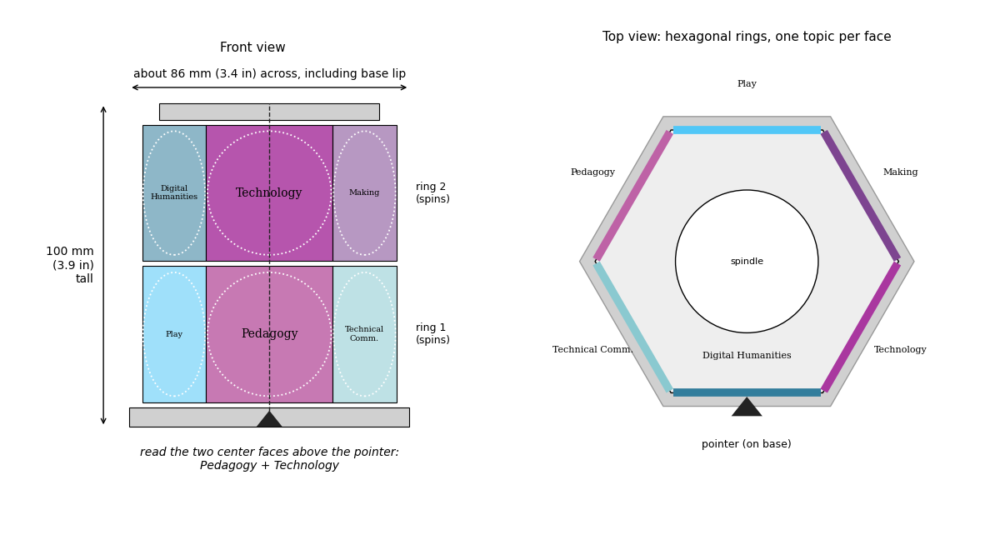
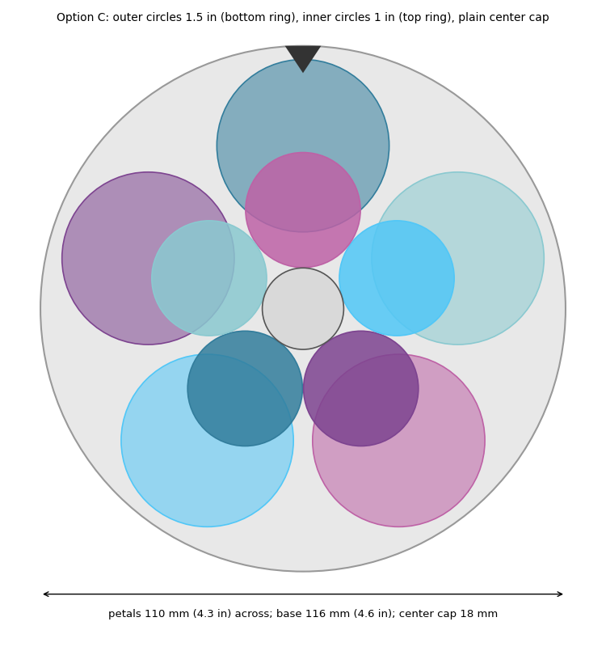

#critical (un)making
## Table of Contents
- [Cryptex](#cryptex)
- [Flower Spinner](#flower-spinner)
  

## Cryptex
Using Claude, I took [my p5.js sketch](https://openprocessing.org/@u514493/2609506) and unflattened it into a 3D printed interactive object. The 3D geometry was created by modifying base models found on MakerWorld, and it was printed on a Bambu Lab A1 in PLA.

<figure>
  
  <figcaption>Final cryptex print</figcaption>
</figure>

### Starting point 
"Traceretry," a [Tracery-style grammar sketch](https://openprocessing.org/sketch/2609506) that generates Spanish nonsense sentences on each click. The concept was to take the sketch's generative grammar off the screen: each spinning ring holds one slot of the sentence, so turning the rings runs the grammar by hand.

### Source models
[Number Safe – Cryptex](https://makerworld.com/en/models/882024) by finniminni (CC BY-NC) supplied the original size, ring shape, and base footprint. [Cryptex Zelda Symbol](https://makerworld.com/en/models/970985) by L.TS (CC BY-NC-SA) is a remix of that design that was downloaded and measured as a starting point.

### Remix
To match the "Traceretry," Spanish words replaced the symbols on the four rings, with words recessed 1 mm into each face. The grammar was rewritten to expand to four-word sentences, with a lot of help from Claude, to ensure every combination is grammatical, with all subjects third person singular and no gender agreement needed on rings 2–4. Sentences constructed remain whimsical nonsense, yet gammatical.

| Ring 1: subject | Ring 2: when / how often | Ring 3: verb | Ring 4: how / where |
|---|---|---|---|
| el gato *(the cat)* | siempre *(always)* | come *(eats)* | mucho *(a lot)* |
| el sol *(the sun)* | nunca *(never)* | baila *(dances)* | poco *(a little)* |
| el pollo *(the chicken)* | no *(does not)* | canta *(sings)* | bien *(well)* |
| el perro *(the dog)* | también *(also)* | duerme *(sleeps)* | mal *(badly)* |
| la luna *(the moon)* | ya *(already)* | salta *(jumps)* | aquí *(here)* |
| la vaca *(the cow)* | hoy *(today)* | corre *(runs)* | allí *(there)* |
| la rana *(the frog)* | ahora *(now)* | lee *(reads)* | arriba *(up / above)* |
| la casa *(the house)* | luego *(later)* | nada *(swims)* | abajo *(down / below)* |
| ella *(she)* | pronto *(soon)* | vuela *(flies)* | lejos *(far away)* |
| él *(he)* | casi *(almost)* | bebe *(drinks)* | cerca *(nearby)* |

The result is 10,000 possible sentences, such as *La vaca siempre vuela arriba* (The cow always flies up). The lock rings and inner bolt were removed from the starting print in favor of spinning-only rings on a solid spindle, and after a first cap fell off, a screw-on thread was added. An OpenSCAD version of the rings accepts any 40 words, so anyone can generate their own printed set. 

### Download 
[Spanish_Word_Cryptex_All.zip](cryptex-flower/Spanish_Word_Cryptex_All.zip) — STL files for any printer, Bambu Studio plates, the OpenSCAD source, a preview of all 40 faces, and a README (CC BY-NC-SA 4.0, crediting both designers above).

<figure>
  
  <figcaption>3D preview of the cryptex casing base and its end cap.</figcaption>
</figure>

## Flower Spinner

Another one of my [p5.js sketches](https://openprocessing.org/@u514493/2592306), created with the help of Claude over a year ago as part of brainstorming a talk about my interdisciplinary research and how I combine different fields (Digital Humanities, Technology, Making, Play, Pedagogy, Technical Communication), inspired this 3D printed flower that can spin. The 3D geometry was entirely generated by Claude, and it was printed on a Bambu Lab A1 in PLA.

<figure>
  
  <figcaption>Final flower spinner</figcaption>
</figure>

### Starting point
To create a material version of my sketch (without all of the research project text) that link to research projects when clicked. The concept was a mash-up object that brings two circles together at random, so each turn suggests a new interdisciplinary project.

### Source models
Claude found two existing spinners prints, [Print in Place Planetary Gear Spinner](https://makerworld.com/en/models/58892-print-in-place-planetary-gear-spinner) and [Spinning Flower Fidget](https://makerworld.com/en/models/1813715-spinning-flower-fidget), as inspiration, but since their petals are fixed in place and their licenses do not allow remixes.

### Remix
Claude went through several iterations as I kept prompting until it could create something that would better represent the interdisciplinarity of my work. We finally settled on an outer ring and an inner ring of circular petals turn independently on one spindle, and the two petals that stop at the pointer form the pair. To remain at a handheld size, the rings stay stacked (inner petals partly covering the outer ones) instead of spreading farther. The finished flower is about 4.6 inches (116 mm) across, with 1.5-inch outer petals and 1-inch inner petals. All six of my research topics appear on both rings, with words recessed into each petal so it prints in one color. 

A ridged knob on top drags both rings by friction; because the outer ring is heavier, it lags behind the lighter inner ring, so the two rings land in different places. Four press-fit feet keep the flower level. It is actually easier to just push the petals than to spin from the top, as too vigorous spinning will unscrew the base. Final iterations included adding feet, which Claude initially tried to print separately rather than printing the base upside-down.

### Download
[Flower_Spinner.zip](cryptex-flower/Flower_Spinner.zip) — Bambu Studio 3MF files for both print plates: the petals (outer and inner rings, printed in rainbow PLA) and the base parts (base with feet, knob and spindle, nut, and spacer ring, printed in galaxy PLA). Licensed [CC BY 4.0](https://creativecommons.org/licenses/by/4.0/).

### Images 

<figure>
  
  <figcaption>Early concept: top view of the paired circles under the pointer, and an exploded view of how the cap, inner ring, outer ring, and base stack on the spindle.</figcaption>
</figure>

<figure>
  
  <figcaption>An early layout option using oval petals, later dropped in favor of round ones.</figcaption>
</figure>

<figure>
  
  <figcaption>Design option D: a hexagonal spinning drum with one topic per face, considered as an alternative to circular petals but not used.</figcaption>
</figure>

<figure>
  
  <figcaption>Design option C, labeled with the outer (1.5 in) and inner (1 in) petal sizes — the layout that was ultimately used.</figcaption>
</figure>

<figure>
  
  <figcaption>The same option C layout shown blank, with the plain center cap where the knob and spindle attach.</figcaption>
</figure>

<figure>
  
  <figcaption>A 3D render of an early "sticker" version, with blank petals meant for stick-on labels and a ridged center knob.</figcaption>
</figure>

<figure>
  
  <figcaption>A 3D render of an earlier five-petal version with topic words molded directly into the petals.</figcaption>
</figure>

<figure>
  
  <figcaption>The final six-petal flower, with recessed topic words and the two-ring layout used for the printed version.</figcaption>
</figure>

